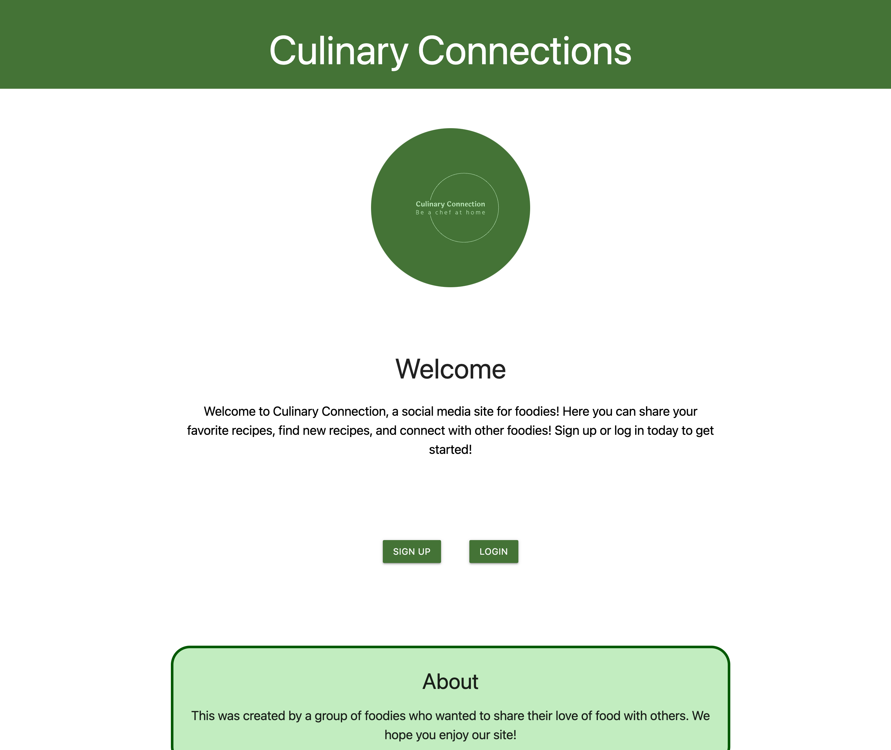

  # Culinary Connections 

## Description
          
Culinary Connections is a social community app for home chefs of all levels. This app lets users view new and trending recipes, create and store recipes and fosters communication with other like minded chefs. We wanted to make this app to connect home chefs of all levels and create one place for chefs to store, create and see new recipes. 

## Table of Contents

* [Installation](#installation)
* [Usage](#usage)
* [Contributing](#contributing)
* [License](#license)

## Installation

Visit the link https://culinary-connections-2a73fa545141.herokuapp.com/, create an account and start using all of the features of Culinary Connections.

## Technologies Used
<u>FrontEnd</u>
HTML 
CSS 
Javascript / jQuery 
Fetch / AJAX 
Web API 
Materialize 
Excalidraw

<u>BackEnd</u>
 Node 
NPM 
Express 
MySQL 
Sequelize ORM 
Npm validator 
Session authentication 
Handlebars - partials

## Usage

This app is easy to use, just click the link and you'll see a sign up  and log in button. Once you create a log in with a unique email and 12 letter password, you can see all of the recipes available on your homepage. If you click on a recipe card in your feed, it will open up so that you can see the details of the recipe, all the ingredients and the easy to read step by step process of how to create that meal. In the nav bar, you will see a link to create a new recipe. On the create recipe page, you will need to enter in a recipe name, ingredients and a step by step instructions for the recipe. Make sure to give your recipe a difficulty level of easy, medium or hard so others know what to expect. We hope you enjoy this app and that it helps support all of your home chef needs.

## License

For more info check [MIT License](https://opensource.org/licenses/MIT)
    

## Contributing
Adrian Frausto, Sam Thomas and Stephanie Lenorovitz

## Questions

For any issues, please contact us at: 
Adrian Frausto 
frausto9298@yahoo.com
 
Or check out my Github page https://github.com/frausto98

Sam Thomas
samtisme@icloud.com
 
Or check out my Github page https://github.com/figuri

Stephanie Lenorovitz
slenorovitz@gmail.com
 
Or check out my Github page https://github.com/GypsyBoho
